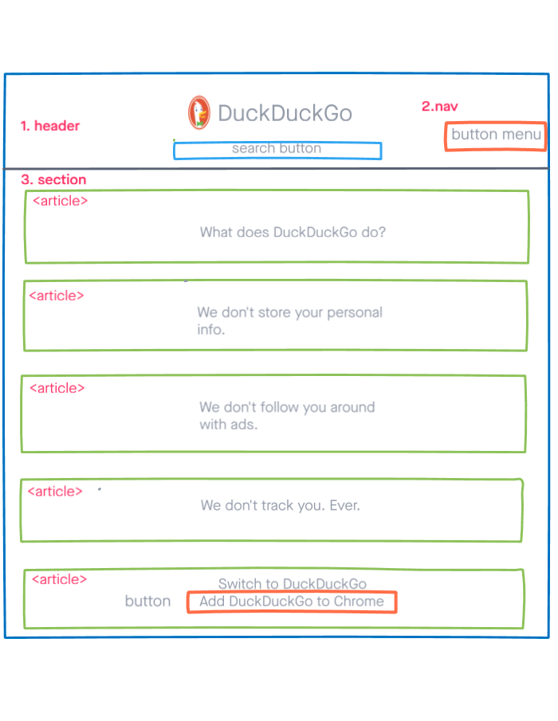

# Development Strategy

> `Hunter_Of_Duck`

A real web site for HYF students to improve their front-end, Git workflow, and soft skills

## Wireframe

## 0. Set-Up

__A User can see my initial repository and live demo__

### Repo

- [Generate from Template](https://github.com/HackYourFutureBelgium/w3-validation-template)
- Clone the repository
- Give a title and description of your project to your README
- Add meta tags,files links and title in the head
- Add wireframe
- Push the changes
- Turn on GitHub Pages

## 1. Header

__As a site visitor, I want to see the header and navbar menu without styled__

### Repo

This user story was developed on a branch called `head-nav`

> assigned to `Mamé`  
> reviewer is `Oguz`

### HTML

- added divs and classes for bootstrap 
- added h1
- added button for menu
- Added img tag without src

### CSS

-Nothing has changed

## 2. Header Style

__As a site visitor, I want to see the header and navbar menu styled__

### Repo

This user story was developed on a branch called `head-nav-style`

> assigned to `Mamé`  
> reviewer is `Oguz`

### HTML

- changed same div tags
- add font awesome icons
- with bootstrap align-items
- add font awesome link and bootstrap css file
- add duckduckgo icon
- adjust input field 
- make first container as fluid to cover all screen

### CSS

- change the color of icons,
- made navbar responsive
- added font family
- gave background for header
- adjust logo and h1
- made box-sizing as border-box to easy calculate total width

## 3. Last Features of Website

__As a site visitor, I want to see website features separately in  the whole screen  and also a button to add features to google chrome__

### Repo

This user story was developed on a branch called `article-last`

> assigned to `Mamé`  
> reviewer is `Oguz`

### HTML

- Added bootstrap classes
- Added website features content
- Added button and image tags
- Add bootstrap card to manage content more easily

### CSS

- styled HTML tags
- made responsive 
- added hover on button
- linked within a page
- align image center and bottom of the page
- align content center of the page

## 4. Advertisers Features of Website

__As a site visitor, I want to see website features separately in  the whole screen  and also a button to add features to google chrome__

### Repo

This user story was developed on a branch called `article-advertiser`

> assigned to `Mamé`  
> reviewer is `Oguz`

### HTML

- Added bootstrap classes
- Added website features content
- Added button and image tags
- Add bootstrap card to manage content more easily

### CSS

- styled HTML tags
- made responsive 
- added hover on button
- align image center and bottom of the page
- align content center of the page

## Finishing Touches

- Write final, complete README:
  - [makeareadme.com](https://www.makeareadme.com/)
  - [bulldogjob](https://bulldogjob.com/news/449-how-to-write-a-good-readme-for-your-github-project)
  - [meakaakka](https://medium.com/@meakaakka/a-beginners-guide-to-writing-a-kickass-readme-7ac01da88ab3)
- Validate code to check for any last mistakes
